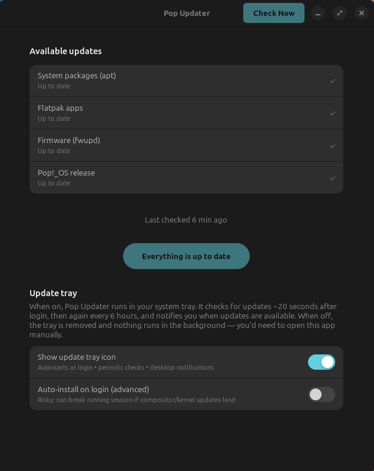

# Pop Updater

A small GTK4/libadwaita update utility for Pop!_OS — designed to fill the gap
left by COSMIC alpha not yet shipping a graphical update manager.

<p align="center">
  
</p>

## What it does

- Checks updates from every package manager you actually have installed:
  - **apt** — system packages and most Pop!_Shop apps
  - **Flatpak** — sandboxed desktop apps
  - **Firmware** — via `fwupd` / LVFS
  - **Pop!_OS release** — read-only check via `pop-upgrade` (never auto-installed)
  - **Snap**, **Homebrew**, **Cargo**, **pipx**, **Nix** — auto-detected when
    their CLIs become available
- **Persistent tray icon** in the COSMIC status area (via Ayatana
  AppIndicator), with periodic checks ~20 seconds after login and every 6
  hours thereafter
- **Per-update detail view**: shows changelog entries (apt), release notes
  (Flathub, fwupd), and links to upstream sources (Launchpad, Flathub,
  PyPI, crates.io, etc.)
- **Desktop notification** when new updates appear (rising-edge only — no
  spam if you hit Check Now repeatedly)
- **Auto-install on login** is available but **off by default**, deliberately:
  pushing a kernel or compositor upgrade mid-session can leave you half-updated

## Architecture highlights

- **Self-extending source registry.** Each package manager declares its own
  `available()` predicate in `SOURCES`. Install snapd (or cargo-install-update,
  or brew, etc.) and the next Check Now adds the row to the GUI on its own —
  no code changes to the UI.
- **Two-process tray + GUI.** GTK4/libadwaita dropped `Gtk.StatusIcon`, and
  the only modern tray API on Linux (Ayatana AppIndicator) is GTK3-based.
  Rather than fighting that, the tray runs as its own small GTK3 process and
  spawns the GTK4 GUI as a subprocess when you click "Open". They share state
  through the JSON cache.
- **Lazy metadata fetch.** Update names appear instantly in the detail view;
  descriptions and homepage links stream in on a background thread so a Check
  Now over a large package list stays fast.

## Requirements

- Pop!_OS 22.04+ or a comparable Ubuntu derivative
- Python 3.10+
- A panel that supports `StatusNotifierItem` (COSMIC's status area, KDE,
  GNOME with the AppIndicator extension, etc.) — strictly required only for
  the tray; the GUI works standalone
- Install script pulls these apt packages: `python3-gi`, `gir1.2-gtk-4.0`,
  `gir1.2-adw-1`, `gir1.2-ayatanaappindicator3-0.1`

## Install

```bash
git clone https://github.com/gravwell-dev/pop-updater.git
cd pop-updater
./install.sh
```

What `install.sh` does:

- Installs the apt dependencies (will prompt for sudo)
- Copies `pop_updater.py` to `~/pop-updater/`
- Installs the launcher shim at `~/.local/bin/pop-updater`
- Installs a `.desktop` entry so the app appears in your app launcher
- Installs the systemd user unit `pop-updater-tray.service` and enables it
- Adds a sudoers rule (scoped to `apt-get update` **only**) so the app can
  refresh apt indexes without prompting on every check. Installs still
  require your password.

The script is idempotent — re-run it after a `git pull` to update.

## Uninstall

```bash
./install.sh --uninstall
```

Removes the launcher, desktop entry, systemd unit, sudoers rule, cache,
and config file. Leaves the source tree alone.

## Configuration

After install, two switches in the GUI (open the app or run `pop-updater`):

- **Show update tray icon** — controls `pop-updater-tray.service`. Off
  means no tray, no login check, no periodic checks; you'd open the app
  manually.
- **Auto-install on login (advanced)** — off by default. When on, the tray's
  periodic check also runs `flatpak update -y`, `pkexec apt-get upgrade -y`,
  and `fwupdmgr update -y` in sequence. The `pkexec` step from a background
  context will fail silently without a TTY for password entry, so in
  practice only flatpak updates apply unless you add a polkit rule. Treat
  this as opt-in for a reason.

## Adding a new package manager

Append a new entry to `SOURCES` in `pop_updater.py` with five fields:

- `label` — what shows in the row
- `available` — a callable returning `True` when the manager is present
  (usually `lambda: shutil.which("foo") is not None`)
- `check` — a callable returning `(count, items)` where each item is
  `"name  oldver → newver"`
- `installer` — a generator yielding log lines, or `None` if read-only
- `metadata` — a callable `(name, version) -> (description, homepage)` for
  the detail view

If the new source belongs in the install queue, add its key to
`INSTALL_ORDER`. The GUI and tray pick it up automatically — no UI code to
touch.

## License

MIT — see [LICENSE](LICENSE).
